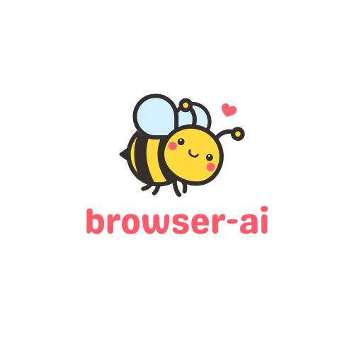

# browser-ai



**browser-ai** is a simple Desktop app that works as a browser, but uses Google Gemini [URL Context tool](https://ai.google.dev/gemini-api/docs/url-context) to create AI-generated summaries of the websites you visit, alongside displaying the actual website itself.

## Install

### Get Dependencies

> [!NOTE]
> This is a `uv` project, so make sure you have it installed, or [install it](https://docs.astral.sh/uv/getting-started/installation/) before getting started with _browser-ai_.

You first need to clone this repository:

```powershell
git clone https://github.com/AstraBert/browser-ai
cd browser-ai
```

Now, you will have to spin up a virtual environment for the application to work. In order to do so, please run:

```powershell
uv sync
```

When executing this command, you might run into some dependency incompatibilities, especially if you are on a Linux or MacOS machine. In that case, please refer to the [posix-specific installation guide](posix-installation.md) for the project.

### Set Env Variables

Rename the [`.env.example`](./.env.example) file to `.env`:

```powershell
mv .env.example .env
```

And then set the `GOOGLE_API_KEY` to a valid Google API Key that has access to Gemini models.

## Launch

Launch the application from your terminal, by typing:

```powershell
uv run main.py
```

You will see a window popping-up on your Desktop: it's your browser app!

You just have to type a URL in the box above the browser, and click the `Go` button, and you'll see the website popping up on your screen, as well as (after some seconds) a summary of that same website generated by Gemini.

## How it works
